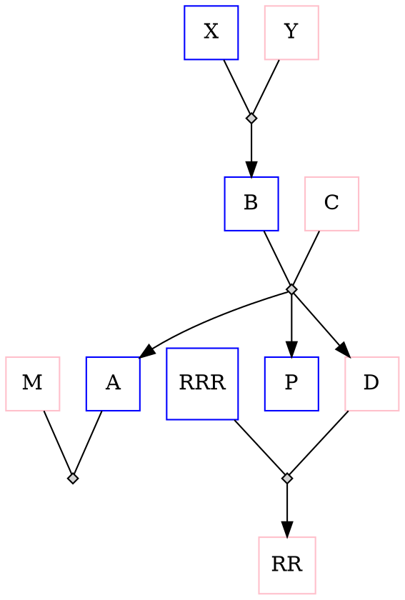
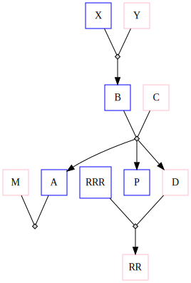

# Family tree plotting DSL

I was having a difficult time understanding a complex family tree being explained to me with a lot of dramatic handwaving and frantic pointing, so I thought I would hunker down and learn/understand the tree once and for all.

Obviously, drawing a digraph for a family tree is the most natural way to go about illuminating oneself of such intricacies. So found [this](https://stackoverflow.com/questions/2271704/family-tree-layout-with-dot-graphviz), and started putting family members into the digraph.

Each person needs multiple lines; 2 nodes for parents, one for the child, a node denoting the parent's union, and then edges connecting the union node with parents and the child. So, you know, a lot.

But of course, maybe it can be a bit more automated...

## Assumptions and DSL
To simplify things, parents are assumed to be biological (not adoptive), and are heterogenous (one male father and one female mother), and parents/children are known. Also a person can have exactly one male dad and one female mother. There is some minor type-checking (such as a person declared male, cannot show up in another line in the "mother" slot etc.)

Here are a few examples showing how to encode a parents-child relationship
1. `A,0,B,C`: `A` is a male (denoted by the `0`) child of `B` (father) and `C` (mother).
2. `D,1,B,C`: `D` is a female (denoted by the `1`) child of `B` (father) and `C` (mother).
3. `0,0,A,M` : The first `0` denotes no-child, of the couple `A` (male) and `M` (female)

A small [DSL](https://en.wikipedia.org/wiki/Domain-specific_language) is defined with the following [CFG](https://en.wikipedia.org/wiki/Context-free_grammar)
```
gender -> 0 | 1
childname -> name | 0
line -> childname,gender,name,name;
full_code -> line | full_code
```

Here is a sample family tree
```
A,0,B,C; P,0,B,C; D,1,B,C; RR,1,RRR,D; B,0,X,Y; 0,0,A,M
```

If `gen_digraph` is called on this specification (`python3 family_tree.py "A,0,B,C; P,0,B,C; D,1,B,C; RR,1,RRR,D; B,0,X,Y; 0,0,A,M"`) we get the following family tree:






## Tests
```
pytest test.py
```

## Final thoughts
Now I just got to convert the dramatic handwaving and frantic pointing to a digraph, study it and master the family tree, but maybe thats for another day...